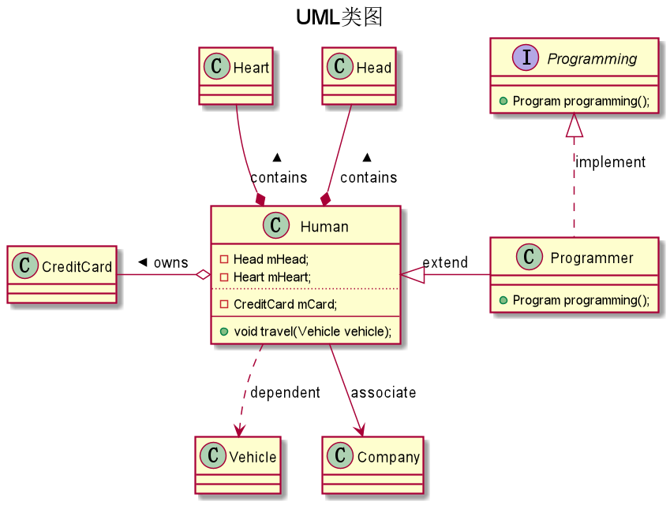

#第1章 简单工厂模式

* 项目/软件/程序开发中应采用OOP思想进行开发以保证可维护性

* 代码规范作为最基础的基本功略过
  * 举个简单例子：变量名的命名应采用小驼峰法命名，并尽量做到见名知意

* 面向对象的思想 即通过封装、继承、多态的处理方式降低程序的耦合度，而结合设计模式，则能使程序变得更加灵活，易于修改和复用

* 复用代码不是简单的复制代码，在OOP中应考虑将相同/相似功能代码集中到一起封装，不同类型的功能代码分开

* 封装
    * 在一个项目中，根据需求的不同会涉及到处理不同业务的代码，这时需要按一定的规律进行封装

* 紧耦合 松耦合
    * 	在项目中的某个类中，当一个方法可能涉及到频繁修改的情况，可以考虑将这个方法按更具体的功能区别进行拆封，并作为此前的类的子类进行重写，这样在需要根据业务进行修改时，只需要对个别子类进行修改，而不用再对之前的基类进行大量修改

* 简单工厂模式
    * 如书中所举例子：
        * 作为基类，其下有多个实现了不同具体运算过程的子类，而通过一个简单工厂类来处理从运算符输入转换为具体运算需求并进一步实例化对应的对象，返回给父类的过程
        * 期间做到了使使用运算类和具体处理运算的子类分离，而只用输入运算符即可满足需求，一方面在使用上比较简便，另一方面程序的可维护性也比较好
    
* UML类图
    